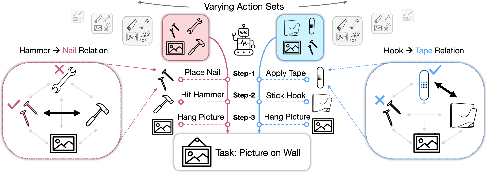
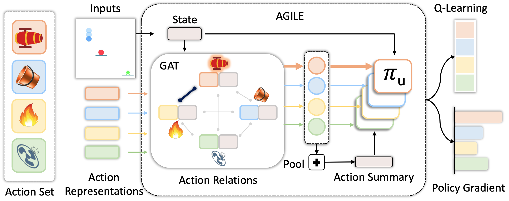
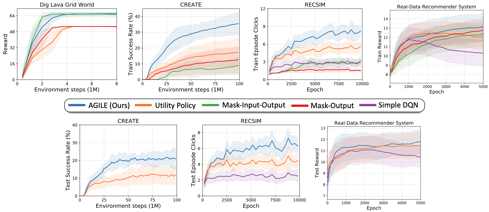

# Know Your Action Set: Learning Action Relations for Reinforcement Learning
#### [[Project Website]](https://sites.google.com/view/varyingaction) [[Paper]](https://openreview.net/pdf?id=MljXVdp4A3N)

[Ayush Jain](https://www-scf.usc.edu/~ayushj)\*<sup>1</sup> &nbsp;[Norio Kosaka](https://rowing0914.github.io)\*<sup>2</sup> &nbsp;[Kyung-Min Kim](https://bi.snu.ac.kr/~kmkim)<sup>2 4</sup> &nbsp;[Joseph J. Lim](https://viterbi-web.usc.edu/~limjj)<sup>3&dagger;4&ddagger;</sup> 

<sup>1</sup>CLVR Lab, University of Southern California (USC) &nbsp;&nbsp;<sup>2</sup>NAVER CLOVA<br/>
<sup>3</sup>Korea Advanced Institute of Science and Technology (KAIST)&nbsp;&nbsp; <sup>4</sup>NAVER AI Lab<br/>
<sup>&dagger;</sup>Work done while at USC&nbsp;&nbsp; <sup>&ddagger;</sup>NAVER AI Advisor

This is the official PyTorch implementation of the paper "**Know Your Action Set: Learning Action Relations for Reinforcement Learning**" (ICLR 2022). 

## Problem



Intelligent agents adapt task solutions based on how the given actions relate to each other.  
(Left) Since a hammer is available, the agent starts by choosing the nail to place on the wall.  
(Right) The nail is no longer a useful tool without a hammer, so using an adhesive tape is better since a hook is provided.


## Approach


Given an action set, AGILE builds a complete action graph by joining action representations and state encoding. A graph attention network learns to attend to other actions that are relevant for each action in the current state. For example, the attention weight is expected to be high between the cannon and the fire because fire can activate the cannon. The output relational action features are better suited for decision-making via a utility network that computes the value or selection prob- ability of the action. This utility network also takes as input the state and mean-pooled vector of the relational action features.

-----

# Code

## Directories

The structure of the repository:

- `data`: Scripts used for analysis figures and experiments.
- `gnn`: Implementation of Action Graph.
- `value_based`: Implementation of Value-based methods for Recommender Systems.
- `policy_based`: Implementation of Policy gradient methods for CREATE / Gridworld environments.
- `main_value_based.py`: Entry point for running value-based methods.
- `main_policy_based.py`: Entry point for policy gradient methods.

## Python Environment

- Python: 3.6 or more is required (Recommended Python 3.6.9)

## Dependencies

- All the python package requirements are in `requirements.txt`. Install them in a new virtual environment (e.g. pyenv, conda) via:
  - `pip install -r requirements.txt`

# Experiments

## Grid world & CREATE (Chain REAction Tool Environment)

- **General Notes**
  - Set Environment Name as:
      * Dig Lava Grid World:  
      `$ENV_NAME` = `'MiniGrid-DualLavaEnv-v0'`
      * CREATE:  
      `$ENV_NAME` = `'CreateLevelPush-v0'`  
  - To run without multi-threading and CUDA (e.g. on mac OS),  add arguments:  
  `--num_processes 1 --eval_num_processes 1 --no_cuda True`  
  - To fit a run on your GPU, reduce `--num_processes ` from its default value of 64 (Grid World) or 48 (CREATE).
  - Videos are generated in policy_based/data/vids.  

- **Baseline Agents**
  - AGILE

      ```shell
      python main_policy_based.py --env_name=$ENV_NAME --prefix=agile --method_name=relational
      ```

  - Utility Policy

      ```shell
      python main_policy_based.py --env_name=$ENV_NAME --prefix=utility_policy --method_name=baseline
      ```

  - Mask-Input-Output

      ```shell
      python main_policy_based.py --env_name=$ENV_NAME --prefix=mask_input_output --method_name=input_mask
      ```

  - Mask-Output
  
      ```shell
      python main_policy_based.py --env_name=$ENV_NAME --prefix=mask_output --method_name=mask
      ```

- **Ablation Agents**
  - Summary-GAT
      ```shell
      python main_policy_based.py --env_name=$ENV_NAME --prefix=summary_gat --method_name=summary --action_summarizer=gnn
      ```

  - Summary-LSTM
      ```shell
      python main_policy_based.py --env_name=$ENV_NAME --prefix=summary_lstm --method_name=summary --action_summarizer=lstm
      ```

  - Summary-Deep Set
      ```shell
      python main_policy_based.py --env_name=$ENV_NAME --prefix=summary_deep_set --method_name=summary --action_summarizer=deep_set
      ```

- **Analysis Agents**
  - AGILE-GCN
      ```shell
      python main_policy_based.py --env_name=$ENV_NAME --prefix=agile_gcn --method_name=relational --gnn_gat_model=gcn2
      ```

  - AGILE-Only Action
      ```shell
      python main_policy_based.py --env_name=$ENV_NAME --prefix=agile_only_action --method_name=relational --summarizer_use_only_action=True
      ```

## RecSim

- Train policy directly with: `python main_value_based.py`

- **Baseline Agents**

  - AGILE
      ```shell
      python main_value_based.py --if_e_node=True --agent_standardRL_type=None --action_summarizer=gnn --graph_type=gat2 --gcdqn_no_graph=False --summarizer_use_only_action=False
      ```

  - Utility Policy(CDQN)
      ```shell
      python main_value_based.py --if_e_node=False --agent_standardRL_type=None --action_summarizer=None --graph_type=None --gcdqn_no_graph=True --summarizer_use_only_action=False
      ```

  - Mask-Input-Output
      ```shell
      python main_value_based.py --if_e_node=False --agent_standardRL_type=1 --action_summarizer=None --graph_type=None --gcdqn_no_graph=True --summarizer_use_only_action=False
      ```

  - Mask-Output
      ```shell
      python main_value_based.py --if_e_node=False --agent_standardRL_type=2 --action_summarizer=None --graph_type=None --gcdqn_no_graph=True --summarizer_use_only_action=False
      ```

  - Simple DQN
      ```shell
      python main_value_based.py --agent_type=dqn --env_name=recsim
      ```

- **Ablation Agents**
  
  - Summary-GAT
      ```shell
      python main_value_based.py --if_e_node=False --agent_standardRL_type=None --action_summarizer=gnn --graph_type=gat2 --gcdqn_no_graph=False --summarizer_use_only_action=False
      ```
    
  - Summary-LSTM
      ```shell
      python main_value_based.py --if_e_node=False --agent_standardRL_type=None --action_summarizer=lstm --graph_type=None --gcdqn_no_graph=False --summarizer_use_only_action=False --gcdqn_use_post_summarise_mlp=False
      ```
  
  - Summary-DeepSet
      ```shell
      python main_value_based.py --if_e_node=False --agent_standardRL_type=None --action_summarizer=deep_set --graph_type=None --gcdqn_no_graph=False --summarizer_use_only_action=False --gcdqn_use_post_summarise_mlp=False
      ```
  
- **Analysis Agents**
  - AGILE-GCN
      ```shell
      python main_value_based.py --if_e_node=True --agent_standardRL_type=None --action_summarizer=gnn --graph_type=gcn --gcdqn_no_graph=False --summarizer_use_only_action=False
      ```
  
  - AGILE-Only Action
  
      ```shell
      python main_value_based.py --if_e_node=True --agent_standardRL_type=None --action_summarizer=gnn --graph_type=gat2 --gcdqn_no_graph=False --summarizer_use_only_action=True
      ```
  
- **Some important parameters**
  - *Agent*  
      + `--agent_type=random/dqn/cdqn/gcdqn` -> change the agent to train
      + `--graph_type=gat2/gcn` -> change the underlying GNN
      + `--action_summarizer=gnn/lstm/deepSet` -> select a method for Action Graph to summarize the actions
      + `--graph_aggregation_type=mean/sum` -> select how to aggregate the node-features in Action Graph
      + `--if_e_node=True/False` -> AGILE or Summary variants

  - *Env* (Experiments done on default values. The following is for reference only.)  
      + `--num_candidates=20` -> Size of the candidate set of items
      + `--recsim_type_reward=click/cpr_score etc` -> change the reward type
      + `--recsim_reward_characteristic=None/shannon_entropy etc` -> change the behaviour of user choice model
      + `--recsim_resampling_method=random/skewed etc` -> change the sampling method of candidate-set construction

## Real-world Recommender Systems

By the following procedure, you can generate the dataset to play with the real-world recommender systems The difference between this synthetic dataset and the real dataset is whether artificial or not. Otherwise, we used the same environment implementation for the experiments.

1. Run `./data/sample/generate_fake.py` to generate the fake data

   1. `cd ./data/sample`
   2. `python generate_fake.py`

2. (** From the root directory)Train the VAE to produce the item embedding

   ```shell
   python value_based/train_embedding.py --env_name=sample --save_dir=./trained_weight/reward_model/sample --data_dir=./data/sample
   ```

3. Train the reward model
  - Offline Reward Model  

     ```shell
     python value_based/train_rewardModel.py --env_name=sample --obs_encoder_type=sequential-rnn --save_dir=./trained_weight/reward_model/sample --data_dir=./data/sample --item_embedding_path=./trained_weight/reward_model/sample/vae_item_embedding.npy --user_embedding_path=./data/sample/user_attr.npy --rm_if_train_simulator=True --rm_offline_or_online=offline
     ```
  - Online Reward Model  

     ```shell
     python value_based/train_rewardModel.py --env_name=sample --obs_encoder_type=sequential-rnn --save_dir=./trained_weight/reward_model/sample --data_dir=./data/sample --item_embedding_path=./trained_weight/reward_model/sample/vae_item_embedding.npy --user_embedding_path=./data/sample/user_attr.npy --rm_if_train_simulator=True --rm_offline_or_online=online
     ```

4. In `./trained_weight/sample/reward_model`, Rename the suitable offline/online reward models to `offline.pkl` and `online.pkl` to use for RL training.

5. Train a policy  
  *You can use the commands in RecSim to train all the agents!*
   ```shell
   python main_value_based.py --env_name=sample --obs_encoder_type=sequential-rnn --data_dir=./data/sample/ --item_embedding_type=pretrained --user_embedding_type=pretrained --item_embedding_path=./trained_weight/reward_model/sample/vae_item_embedding.npy --user_embedding_path=./data/sample/user_attr.npy --data_category_cols=genre/size --rm_weight_save_dir=./trained_weight/reward_model/sample --recsim_if_mdp=False
   ```

# Results


   
# Acknowledgement

- PPO code is based on the [Pytorch implementation of PPO by Ilya Kostrikov](https://github.com/ikostrikov/pytorch-a2c-ppo-acktr-gail).
- Utility Network and CREATE environment code is based on [CLVR Lab's Generalization to new actions in RL implementation](https://github.com/clvrai/new-actions-rl)
- VAE code is based on https://github.com/AntixK/PyTorch-VAE/blob/master
- GCN code is based on https://github.com/pyg-team/pytorch_geometric
- GAT code is based on https://github.com/Diego999/pyGAT
- The Grid world environment is adapted from https://github.com/maximecb/gym-minigrid
- RecSim Simulator: https://github.com/google-research/recsim

# Citation
If you find this work useful in your research, please consider citing:
```
@inproceedings{
  jain2022know,
  title={Know Your Action Set: Learning Action Relations for Reinforcement Learning},
  author={Ayush Jain and Norio Kosaka and Kyung-Min Kim and Joseph J Lim},
  booktitle={International Conference on Learning Representations},
  year={2022},
  url={https://openreview.net/forum?id=MljXVdp4A3N}
}
```